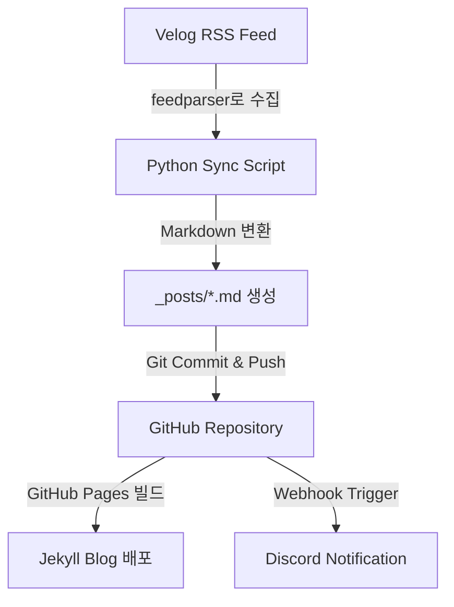

# aneomagig.github.io
my ve-log https://aneomagig.github.io/

# 🎉 Velog → Jekyll Auto Blog Sync

> **Velog 포스트를 자동으로 Jekyll 블로그로 동기화하고, GitHub Pages에 자동 배포하며, Discord로 새 글 알림까지 보내주는 풀 오토 블로그 파이프라인입니다.**

---

## 🪄 프로젝트 개요

이 레포지토리는 **Velog**에 올린 글을 자동으로 크롤링하여  
**Jekyll 기반 개인 블로그(aneomagig.github.io)** 로 동기화하고,  
GitHub Actions를 이용해 **6시간마다 자동 빌드·배포**되는 시스템입니다.

✅ 추가로 새 글이 감지되면 **Discord 웹훅을 통해 자동 알림**이 전송됩니다.  
(“📰 새로운 포스트가 자동으로 업로드되었습니다!”)

---

## 🧭 전체 동작 구조



## ⚙️ 주요 기능 요약
📝 Velog → Markdown 변환
- RSS 피드(feedparser)를 읽어 _posts/ 폴더에 자동 변환 저장

🖼️ 이미지 자동 다운로드
- Velog 본문 내 이미지 URL을 로컬 /assets/images/ 경로로 자동 저장

🔁 자동 커밋 & 푸시
- 새 글이 생기면 Velog Sync Bot이 자동으로 GitHub에 푸시

🕓 6시간마다 자동 실행
- cron: "0 */6 * * *" 주기로 자동 빌드 및 배포

🔔 Discord 알림
- 새 포스트가 생성되면 웹훅으로 실시간 알림 전송

🌐 GitHub Pages 자동 배포
- _posts 업데이트 시 Jekyll로 자동 재빌드 및 배포

## 📂 디렉토리 구조
```
📁 repository-root
├── _posts/                    # Velog → 변환된 블로그 포스트 (Markdown)
├── assets/
│   └── images/                # Velog 이미지 자동 다운로드 폴더
├── velog_to_jekyll_images.py  # RSS 크롤링 + 변환 스크립트
├── _config.yml                # Jekyll 설정파일
├── index.html / index.markdown
└── .github/
    └── workflows/
        └── velog-sync.yml     # 자동화 워크플로우 설정
```

## 🚀 자동화 워크플로우 (GitHub Actions)
📄 .github/workflows/velog-sync.yml
💡 변경된 포스트가 없을 경우 Discord 알림을 자동으로 건너뜁니다.


## 🌐 배포 방식
- GitHub Pages로 자동 배포됨
- main 브랜치 → _posts 업데이트 시 → 자동 빌드
- Jekyll 테마는 _config.yml에서 설정 (예: minima, custom-theme 등)
- site.url 및 baseurl 설정 확인 필수

## 🧩 환경 변수 설정

Repository → Settings → Secrets → Actions
DISCORD_WEBHOOK_URL에 Discord 웹훅 URL

