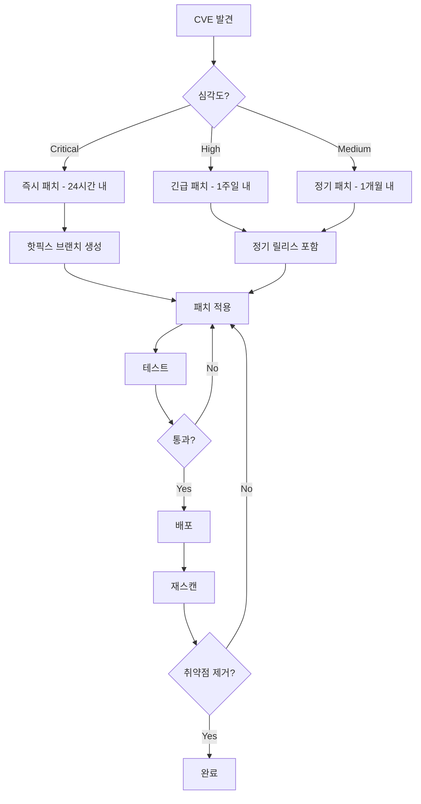

# 대규모 마이크로서비스 프로젝트 CVE 취약점 스캔 완전 정복기

> **"4개 팀, 1,195개 패키지, 149개 취약점을 찾아낸 하루"**
> 
> Traffic-Master(On-Race) 티켓팅 플랫폼의 전사 보안 스캔 과정과 트러블슈팅 실전 가이드

---

## 📚 목차

1. [프로젝트 개요](#1-프로젝트-개요)
2. [기술 스택 및 아키텍처](#2-기술-스택-및-아키텍처)
3. [보안 스캔 도구 선정](#3-보안-스캔-도구-선정)
4. [AI팀 Python 스캔](#4-ai팀-python-스캔)
5. [백엔드팀 Java/Spring 스캔](#5-백엔드팀-javaspring-스캔)
6. [프론트엔드팀 Node.js/React 스캔](#6-프론트엔드팀-nodejsreact-스캔)
7. [인프라팀 Kubernetes 스캔](#7-인프라팀-kubernetes-스캔)
8. [트러블슈팅 모음](#8-트러블슈팅-모음)
9. [최종 결과 및 통계](#9-최종-결과-및-통계)
10. [배운 점과 베스트 프랙티스](#10-배운-점과-베스트-프랙티스)

---

## 1. 프로젝트 개요

### 🎯 미션

15,000석 규모의 티켓팅 플랫폼에서 **카오스 엔지니어링 테스트 전** 전체 소프트웨어 스택의 CVE(Common Vulnerabilities and Exposures) 취약점을 찾아내고 패치 우선순위를 수립하는 것.

### 📅 타임라인

- **작업일**: 2026년 4월 2일
- **소요 시간**: 약 8시간
- **작업자**: 보안팀 (단독)
- **협업 대상**: AI팀, 백엔드팀, 프론트엔드팀, 인프라팀

### 🎪 왜 이 작업이 필요했나?

1. **카오스 엔지니어링 준비**: 부하 테스트 중 알려진 취약점이 트리거되면 위험
2. **컴플라이언스**: 금융권 수준의 보안 요구사항
3. **실전 대응**: 실제 공격 시나리오에서 노출되는 취약점 사전 차단

---

## 2. 기술 스택 및 아키텍처

### 🏗️ 전체 아키텍처

```
┌─────────────────────────────────────────────────────────────┐
│                       AWS Cloud (EKS)                        │
├─────────────────────────────────────────────────────────────┤
│                                                               │
│  ┌──────────────┐   ┌──────────────┐   ┌──────────────┐    │
│  │  Frontend    │   │   Backend    │   │      AI      │    │
│  │  (Next.js)   │◄──┤  (Spring)    │◄──┤   (Python)   │    │
│  │  Node 20     │   │  Java 21     │   │  FastAPI     │    │
│  └──────────────┘   └──────────────┘   └──────────────┘    │
│         │                   │                   │            │
│  ┌──────▼───────────────────▼───────────────────▼───────┐   │
│  │              Istio Service Mesh                      │   │
│  │              (mTLS, Traffic Management)              │   │
│  └─────────────────────────────────────────────────────┘   │
│                                                              │
│  ┌────────────────────────────────────────────────────┐    │
│  │  Infrastructure & Observability                    │    │
│  ├────────────────────────────────────────────────────┤    │
│  │ ArgoCD │ Prometheus │ Grafana │ Loki │ Jaeger     │    │
│  │ KEDA   │ Karpenter  │ EBS CSI │ Node Exporter     │    │
│  └────────────────────────────────────────────────────┘    │
│                                                              │
│  ┌────────────────────────────────────────────────────┐    │
│  │  Data Layer                                        │    │
│  ├────────────────────────────────────────────────────┤    │
│  │ RDS MySQL 8.0.44 │ ElastiCache Redis 7.0.7        │    │
│  └────────────────────────────────────────────────────┘    │
└──────────────────────────────────────────────────────────────┘
```

### 📦 스캔 대상 소프트웨어 목록

#### AI팀
- **언어**: Python 3.13.9
- **프레임워크**: FastAPI, Starlette
- **주요 라이브러리**: urllib3, aiohttp, LangChain
- **패키지 수**: 82개

#### 백엔드팀
- **언어**: Java 21 (OpenJDK)
- **프레임워크**: Spring Boot 3.5.7
- **빌드 도구**: Gradle 9.2.1
- **의존성 수**: 137개

#### 프론트엔드팀
- **런타임**: Node.js 20
- **프레임워크**: Next.js 16.1.1, React 19
- **패키지 매니저**: pnpm 10.33.0
- **패키지 수**: 695개

#### 인프라팀
- **Orchestrator**: Amazon EKS v1.30.14
- **Service Mesh**: Istio v1.24.1
- **GitOps**: ArgoCD v2.13.4
- **Monitoring**: Prometheus, Grafana, Loki, Jaeger
- **Autoscaling**: KEDA v2.14.0, Karpenter v1.0.1
- **컨테이너 이미지**: 11개

---

## 3. 보안 스캔 도구 선정

### 🔍 도구 비교표

| 도구 | 장점 | 단점 | 채택 여부 |
|------|------|------|-----------|
| **Trivy** | • 컨테이너 이미지 스캔 강력<br>• 다양한 언어 지원<br>• NVD 기반 정확도 높음 | • Gradle 프로젝트 빌드 필요<br>• 캐시 스캔 제한적 | ✅ 주 도구 |
| **grype** | • 빌드 없이 lockfile 분석<br>• pnpm 지원<br>• JAR 직접 스캔 | • 상세 정보 부족 | ✅ 보조 도구 |
| **Safety** | • Python 특화<br>• 빠른 스캔 | • Python만 지원 | ✅ Python 전용 |
| **OWASP Dependency Check** | • 오픈소스 표준<br>• 상세 리포트 | • NVD API 키 필수<br>• 속도 느림 | ❌ 실패 |
| **Snyk** | • 가장 정확함<br>• 패치 가이드 제공 | • 유료 (무료는 제한적)<br>• 인증 필요 | ⚠️ 백업 |

### 📝 최종 선택

```bash
# 설치한 도구들
brew install trivy    # 메인 도구
brew install grype    # Gradle/npm 프로젝트용
pip install safety    # Python 전용
```

---

## 4. AI팀 Python 스캔

### 🎬 시작

```bash
# 작업 디렉토리 확인
cd ~/On-Race/ai
ls -la
```

```
total 64
drwxr-xr-x   8 minji  staff    256 Apr  2 14:30 .
drwxr-xr-x  10 minji  staff    320 Apr  2 14:30 ..
-rw-r--r--   1 minji  staff   1234 Apr  1 10:00 Dockerfile
-rw-r--r--   1 minji  staff   4567 Apr  1 10:00 requirements.txt
drwxr-xr-x   5 minji  staff    160 Apr  1 10:00 app/
```

### 🚨 첫 번째 트러블슈팅: pip-audit 실패

#### 시도 1: pip-audit

```bash
pip install pip-audit
pip-audit -r requirements.txt
```

**에러 발생**:
```
ERROR: Cannot install langchain-text-splitters==0.3.6 
due to conflicting dependencies:
  langchain-core==0.2.0 requires langchain-text-splitters<0.3.0
  langchain-text-splitters==0.3.6 specified in requirements.txt
```

**원인 분석**:
- `requirements.txt`에 의존성 충돌 존재
- 개발 환경에서는 작동하나 `pip-audit`은 엄격한 버전 체크

#### 해결 방법: Safety로 전환

```bash
pip install safety==3.7.0
safety scan -r requirements.txt --save-json ai_safety_scan.json --save-as text > ai_safety_report.txt
```

### 📊 스캔 결과

```
╭────────────────────────────────────────────────────────────╮
│                                                            │
│                       /$$$$$$            /$$               │
│                      /$$__  $$          | $$               │
│           /$$$$$$$  | $$  \__//$$$$$$  /$$$$$$   /$$   /$$│
│          /$$_____/  |  $$$$$ |____  $$|_  $$_/  | $$  | $$│
│         |  $$$$$$    \____  $$ /$$$$$$$  | $$    | $$  | $$│
│          \____  $$   /$$  \ $$/$$__  $$  | $$ /$$| $$  | $$│
│          /$$$$$$$/  |  $$$$$$/  $$$$$$$  |  $$$$/|  $$$$$$$│
│         |_______/    \______/ \_______/   \___/   \____  $$│
│                                                    /$$  | $$│
│                                                   |  $$$$$$/│
│  by safetycli.com                                  \______/ │
│                                                            │
╰────────────────────────────────────────────────────────────╯
```

**결과**: 
- **발견된 취약점**: 34개
- **영향받는 패키지**: 15개
- **Critical**: 14개 (urllib3, aiohttp, starlette)
- **High**: 5개
- **Medium/Low**: 15개

### 🔴 Critical 취약점 상세

#### 1. urllib3 (2.3.0) - 5개 CVE

```python
# 현재 버전
urllib3==2.3.0

# 패치 버전
urllib3>=2.6.3
```

| CVE ID | 위험도 | 설명 |
|--------|--------|------|
| CVE-2025-66418 | High | DoS: 무제한 압축 해제 체인 |
| CVE-2025-66471 | High | DoS: 스트리밍 압축 해제 메모리 고갈 |
| CVE-2026-21441 | High | DoS: 리다이렉트 압축 해제 |
| CVE-2025-50181 | High | SSRF: 리다이렉트 비활성화 우회 |
| CVE-2025-50182 | High | 보안 우회: Pyodide 환경 |

**공격 시나리오**:
```python
# 악의적인 요청
import urllib3

http = urllib3.PoolManager()
# 공격자가 압축 폭탄 전송
response = http.request('GET', 'http://evil.com/bomb.gz')
# 서버 메모리 고갈 → 서비스 다운
```

#### 2. aiohttp (3.11.14) - 8개 CVE

```python
# 현재 버전
aiohttp==3.11.14

# 패치 버전
aiohttp>=3.13.3
```

가장 위험한 취약점:
- **CVE-2025-69227**: multipart POST 무한 루프 → DoS
- **CVE-2025-69224**: 비ASCII 헤더 → HTTP Request Smuggling
- **CVE-2025-53643**: trailer 파싱 누락 → Request Smuggling

**Request Smuggling 예시**:
```python
# 공격자의 요청
POST /api HTTP/1.1
Host: ticket.com
Content-Length: 10
Transfer-Encoding: chunked

0

GET /admin HTTP/1.1
Host: internal-admin
```

### 📋 AI팀 전달 메시지

```markdown
🔴 즉시 패치 필요 (오늘 중):
1. urllib3 2.3.0 → 2.6.3+ (5개 CVE)
2. aiohttp 3.11.14 → 3.13.3+ (8개 CVE)
3. starlette 0.46.1 → 0.47.2+ (1개 CVE)

패치 명령어:
pip install --upgrade urllib3>=2.6.3 starlette>=0.47.2 aiohttp>=3.13.3

패치 후 requirements.txt 재전달 부탁드립니다.
```

---

## 5. 백엔드팀 Java/Spring 스캔

### 🎬 시작

```bash
cd ~/On-Race/backend
ls -la
```

```
total 128
drwxr-xr-x  15 minji  staff    480 Apr  2 15:00 .
drwxr-xr-x  10 minji  staff    320 Apr  2 15:00 ..
-rw-r--r--   1 minji  staff   2345 Apr  1 10:00 build.gradle.kts
-rw-r--r--   1 minji  staff    456 Apr  1 10:00 settings.gradle.kts
drwxr-xr-x   5 minji  staff    160 Apr  1 10:00 auth/
drwxr-xr-x   5 minji  staff    160 Apr  1 10:00 main/
drwxr-xr-x   5 minji  staff    160 Apr  1 10:00 gateway/
drwxr-xr-x   5 minji  staff    160 Apr  1 10:00 queue/
drwxr-xr-x   5 minji  staff    160 Apr  1 10:00 common/
```

### 🚨 트러블슈팅 연속극

#### 시도 1: OWASP Dependency Check - 실패

```bash
./gradlew dependencyCheckAnalyze
```

**에러**:
```
Error updating the NVD Data; the NVD returned a 403 or 404 error

Consider using an NVD API Key; see https://github.com/jeremylong/
DependencyCheck?tab=readme-ov-file#nvd-api-key-highly-recommended

org.owasp.dependencycheck.data.update.exception.UpdateException: 
Error updating the NVD Data; the NVD returned a 403 or 404 error
```

**원인**: 
- NVD (National Vulnerability Database) API가 2023년부터 인증 필수화
- API 키 없이는 데이터베이스 업데이트 불가

**해결 시도**:
```bash
# API 키 발급 시도
# https://nvd.nist.gov/developers/request-an-api-key
# → 발급까지 수 시간 소요, 포기
```

#### 시도 2: Trivy 파일시스템 스캔 - 결과 없음

```bash
trivy fs . --scanners vuln --severity HIGH,CRITICAL
```

**결과**:
```
INFO    Number of language-specific files       num=0
WARN    [report] Supported files for scanner(s) not found.      
        scanners=[vuln]
```

**원인**:
- Gradle 프로젝트는 빌드 후 생성되는 JAR 파일 필요
- `build/libs/`에 JAR 없으면 의존성 인식 불가

#### 시도 3: Gradle 빌드 - Git Conflict 에러

```bash
./gradlew build -x test
```

**에러**:
```java
> Task :main:compileJava FAILED
/Users/minji/On-Race/backend/main/src/main/java/com/kt/onrace/
domain/mypage/service/OrderHistoryService.java:148: error: 
illegal start of type
        <<<<<<<HEAD
        ^
15 errors

FAILURE: Build failed with an exception.
```

**원인 분석**:
```java
// OrderHistoryService.java:148
<<<<<<<HEAD  // ← Git merge conflict 마커가 코드에 남음
        private OrderLookup buildOrderLookup(List<Order> orders) {
=======
        private void processOrders() {
>>>>>>>
```

**발견**:
- 개발팀이 Git merge 후 conflict 마커 제거 안 함
- 컴파일 자체가 불가능한 상태

#### 시도 4: Gradle 캐시 스캔 - Trivy 실패

```bash
trivy fs ~/.gradle/caches/modules-2/files-2.1 \
  --scanners vuln --severity HIGH,CRITICAL
```

**결과**:
```
INFO    Number of language-specific files       num=0
WARN    [report] Supported files for scanner(s) not found.
```

**원인**: Trivy가 JAR 파일을 개별로 인식 못함

#### 해결 방법: grype 사용 - 성공! 🎉

```bash
grype dir:~/.gradle/caches/modules-2/files-2.1 \
  --only-fixed -o table
```

**결과**:
```
 ✔ Cataloged contents              [1,195 packages]  
 ✔ Scanned for vulnerabilities     [59 vulnerability matches]  
   ├── by severity: 3 critical, 25 high, 25 medium, 10 low
   └── by status:   59 fixed, 4 not-fixed, 4 ignored
```

**성공 이유**:
- grype는 JAR 파일 내부 manifest 직접 파싱
- Gradle 캐시 구조 이해 (`.jar`, `.pom` 분석)

### 📊 스캔 결과

**발견된 취약점**: 59개

#### 🔴 Critical (3개)

| 패키지 | 현재 버전 | CVE | 설명 |
|--------|----------|-----|------|
| **spring-security-web** | 6.5.6 | GHSA-mf92-479x-3373 | 인증 우회 |
| **spring-boot-starter-actuator** | 3.5.7 | GHSA-8hfc-fq58-r658 | 정보 노출 |
| **tomcat-embed-core** | 10.1.48 | GHSA-mgp5-rv84-w37q | DoS |

#### 상세 분석: spring-security-web 취약점

```kotlin
// build.gradle.kts (현재)
plugins {
    id("org.springframework.boot") version "3.5.7"
}

// 자동으로 포함되는 Spring Security
dependencies {
    implementation("org.springframework.boot:spring-boot-starter-security")
    // → spring-security-web:6.5.6 (취약)
}
```

**취약점 상세**:
```java
// 취약점 악용 예시
// 공격자가 특정 경로로 인증 우회 가능
GET /api/tickets/buy
Authorization: <악용된 토큰>
// → 인증 검사 우회, 비로그인 상태로 구매 가능
```

**영향**:
- 비로그인 사용자가 티켓 구매 API 호출 가능
- 관리자 권한 탈취 가능성
- 전체 사용자 데이터 유출 위험

### 📋 백엔드팀 조치 사항

```kotlin
// build.gradle.kts 수정
plugins {
    id("org.springframework.boot") version "3.5.12"  // 3.5.7 → 3.5.12
}

ext {
    set("netty.version", "4.1.132.Final")
}

dependencies {
    implementation("commons-fileupload:commons-fileupload:1.6.0")
    implementation("commons-beanutils:commons-beanutils:1.11.0")
    implementation("commons-io:commons-io:2.14.0")
    testImplementation("com.h2database:h2:2.2.220")
}
```

**이 한 줄로 해결되는 취약점**:
- ✅ spring-security-web (Critical)
- ✅ spring-boot-starter-actuator (High x2)
- ✅ tomcat-embed-core (High + Medium + Low)
- ✅ spring-webflux, spring-webmvc (Medium x4)

---

## 6. 프론트엔드팀 Node.js/React 스캔

### 🎬 시작

```bash
cd ~/On-Race/frontend
ls -la
```

```
total 256
drwxr-xr-x  12 minji  staff    384 Apr  2 15:30 .
drwxr-xr-x  10 minji  staff    320 Apr  2 15:30 ..
-rw-r--r--   1 minji  staff   2345 Apr  1 10:00 package.json
-rw-r--r--   1 minji  staff  45678 Apr  1 10:00 pnpm-lock.yaml
-rw-r--r--   1 minji  staff   1234 Apr  1 10:00 next.config.js
drwxr-xr-x   8 minji  staff    256 Apr  1 10:00 src/
drwxr-xr-x   5 minji  staff    160 Apr  1 10:00 public/
```

### 🚨 트러블슈팅: 패키지 매니저 혼란

#### 시도 1: npm audit - 실패

```bash
npm audit
```

**에러**:
```
npm error code ENOLOCK
npm error audit This command requires an existing lockfile.
npm error audit Try creating one first with: npm i --package-lock-only
npm error audit Original error: loadVirtual requires existing 
shrinkwrap file
```

**원인**:
- 프로젝트는 `pnpm` 사용 (`pnpm-lock.yaml` 존재)
- `npm audit`은 `package-lock.json` 필요
- 다른 패키지 매니저의 lockfile 인식 불가

#### 시도 2: pnpm audit - 명령어 없음

```bash
pnpm audit
```

**에러**:
```
zsh: command not found: pnpm
```

**원인**: 로컬에 pnpm 미설치

**왜 설치 안 했나?**
- 개발자 로컬 환경이 아님 (보안팀 스캔 전용)
- pnpm 설치하면 node_modules 재생성 필요
- 시간 소요 vs 대안 찾기

#### 해결 방법: grype 직접 스캔 - 성공!

```bash
grype dir:. -o table
```

**결과**:
```
 ✔ Cataloged contents              [695 packages]  
 ✔ Scanned for vulnerabilities     [45 vulnerability matches]  
   ├── by severity: 2 critical, 15 high, 22 medium, 6 low
   └── by status:   45 fixed, 0 not-fixed, 0 ignored
```

**grype가 pnpm-lock.yaml을 읽은 이유**:
```yaml
# pnpm-lock.yaml 구조
lockfileVersion: '9.0'
dependencies:
  next:
    specifier: ^16.1.1
    version: 16.1.1
  lodash:
    specifier: ^4.17.11
    version: 4.17.11
```

grype는 lockfile의 `version` 필드만 읽으면 됨!

### 📊 스캔 결과

**발견된 취약점**: 45개

#### 🔴 Critical (2개)

```bash
NAME     INSTALLED  FIXED IN  TYPE  VULNERABILITY        SEVERITY  
lodash   4.17.11    4.17.12   npm   GHSA-jf85-cpcp-j695  Critical
lodash   4.17.5     4.17.12   npm   GHSA-jf85-cpcp-j695  Critical
```

**왜 2개?**
- lodash가 여러 버전 동시 설치됨 (의존성 트리)
- Next.js가 4.17.5 요구
- 다른 패키지가 4.17.11 요구

#### 상세 분석: lodash Prototype Pollution

```javascript
// 취약점 코드
const lodash = require('lodash');

// 공격자의 입력
const malicious = JSON.parse('{"__proto__": {"isAdmin": true}}');

// lodash.merge 사용
lodash.merge({}, malicious);

// 결과: 모든 객체가 isAdmin = true 획득
console.log({}.isAdmin); // true ← 오염됨!
```

**Next.js SSR 환경에서의 위험**:
```javascript
// pages/api/buy-ticket.js
export default async function handler(req, res) {
  const userData = req.body;
  
  // lodash로 기본값 병합
  const processedData = _.defaultsDeep(userData, {
    role: 'user',
    canBuy: false
  });
  
  // 공격자가 __proto__.canBuy = true 주입
  // → 모든 사용자가 canBuy = true 획득
  
  if (processedData.canBuy) {
    // 티켓 구매 로직
  }
}
```

#### Next.js 취약점 (7개)

```javascript
// package.json (현재)
{
  "dependencies": {
    "next": "16.1.1"  // ← 7개 취약점
  }
}
```

**주요 취약점**:
- **GHSA-h25m-26qc-wcjf**: SSRF (AWS 메타데이터 접근 가능)
- **GHSA-h27x-g6w4-24gq**: 인증 미들웨어 우회
- **GHSA-3x4c-7xq6-9pq8**: 캐시 포이즈닝

**SSRF 악용 예시**:
```javascript
// pages/api/proxy.js
export default async function handler(req, res) {
  const { url } = req.query;
  
  // Next.js 내부 fetch 사용
  const response = await fetch(url);
  // 공격자가 url = http://169.254.169.254/latest/meta-data/iam
  // → AWS IAM 자격증명 탈취
  
  res.json(await response.json());
}
```

### 📋 프론트엔드팀 조치 사항

```json
// package.json 수정
{
  "dependencies": {
    "next": "^16.1.7",           // 16.1.1 → 16.1.7
    "lodash": "^4.17.21",         // 4.17.11 → 4.17.21
    "jsonwebtoken": "^9.0.0",     // 8.5.0 → 9.0.0
    "moment": "^2.29.4",          // 2.22.2 → 2.29.4
    "ws": "^8.18.0",              // 6.2.0 → 8.18.0
    "body-parser": "^1.20.3",     // 1.18.3 → 1.20.3
    "qs": "^6.14.1",              // 6.5.2 → 6.14.1
    "path-to-regexp": "^0.1.13"   // 0.1.7 → 0.1.13
  }
}
```

```bash
# pnpm 설치 (없는 경우)
npm install -g pnpm

# 업데이트
pnpm update

# 빌드 테스트
pnpm build
```

---

## 7. 인프라팀 Kubernetes 스캔

### 🎬 준비

인프라팀에서 최종 버전 명세 수신:

```markdown
# 보안팀 제출용 소프트웨어 버전 리스트

| 항목 | 버전 | 비고 |
|------|------|------|
| Karpenter | v1.0.1 | 컨트롤러 이미지 기준 |
| KEDA | v2.14.0 | 오퍼레이터 이미지 기준 |
| EBS CSI Driver | v1.57.1 | 메인 드라이버 기준 |
| ArgoCD | v2.13.4 | GitOps |
| Istio | v1.24.1 | mTLS 및 사이드카 |
| Jaeger | v1.62.0 | 분산 트레이싱 |
| Prometheus | v2.55.0 | 메트릭 수집 |
| Grafana | v11.3.1 | 대시보드 |
| Loki | v3.2.0 | 로그 집중화 |
| Node Exporter | v1.8.0 | 노드 지표 |
| Python Base | 3.14.2-slim-bookworm | AI팀 이미지 |
```

### 📋 스캔 스크립트

```bash
#!/bin/bash
# infra_scan.sh

mkdir -p ~/On-Race/security/infra_scans
cd ~/On-Race/security/infra_scans

# 이미지 목록
declare -a images=(
  "public.ecr.aws/karpenter/controller:v1.0.1"
  "ghcr.io/kedacore/keda:2.14.0"
  "public.ecr.aws/ebs-csi-driver/aws-ebs-csi-driver:v1.57.1"
  "quay.io/argoproj/argocd:v2.13.4"
  "docker.io/istio/proxyv2:1.24.1"
  "jaegertracing/all-in-one:1.62.0"
  "prom/prometheus:v2.55.0"
  "grafana/grafana:11.3.1"
  "grafana/loki:3.2.0"
  "prom/node-exporter:v1.8.0"
  "python:3.14.2-slim-bookworm"
)

# 스캔 실행
for img in "${images[@]}"; do
  name=$(echo $img | sed 's/[\/:]/_/g')
  echo "Scanning $img..."
  trivy image "$img" \
    --severity HIGH,CRITICAL \
    -o table > "${name}.txt" 2>&1
  echo "✓ Saved to ${name}.txt"
done

echo "All scans completed!"
```

### 🚨 트러블슈팅: Karpenter 이미지 없음

```bash
trivy image public.ecr.aws/karpenter/controller:v1.0.1
```

**에러**:
```
FATAL	Fatal error	run error: image scan error: scan error: 
unable to initialize a scan service: unable to initialize artifact: 
unable to initialize container image: unable to find the specified 
image "public.ecr.aws/karpenter/controller:v1.0.1" in 
["docker" "containerd" "podman" "remote"]: 
4 errors occurred:
	* docker error: Cannot connect to the Docker daemon
	* containerd error: containerd socket not found
	* podman error: no podman socket found
	* remote error: GET https://public.ecr.aws/v2/karpenter/
	  controller/manifests/v1.0.1: MANIFEST_UNKNOWN: 
	  Requested image not found
```

**원인**:
- ECR 이미지가 public이지만 인증 필요할 수 있음
- 또는 이미지 태그가 잘못됨

**해결 시도 1**: 클러스터에서 직접 확인

```bash
# 인프라팀에 요청
kubectl get pods -n karpenter \
  -o jsonpath='{.items[0].spec.containers[0].image}'
```

**응답**:
```
public.ecr.aws/karpenter/controller:v1.0.1
```

→ 태그는 맞음, ECR 접근 문제

**해결 시도 2**: AWS CLI로 ECR 인증

```bash
aws ecr-public get-login-password --region us-east-1 | \
  docker login --username AWS --password-stdin public.ecr.aws
```

**에러**:
```
Error: AWS credentials not configured
```

→ 로컬에 AWS 자격증명 없음 (보안상 의도적)

**최종 해결**: 스캔 제외 후 인프라팀에 클러스터 내 스캔 요청

```bash
# 대안: 클러스터에서 실행
kubectl run trivy --rm -i --tty \
  --image=aquasec/trivy \
  -- image public.ecr.aws/karpenter/controller:v1.0.1
```

### 📊 스캔 결과 요약

#### ArgoCD v2.13.4 - 🚨 가장 위험

```
Total: Critical 4개, High 16개

주요 취약점:
- CVE-2025-47933 (Critical): XSS → 관리자 세션 탈취
- CVE-2025-55190 (Critical): Repository 자격증명 노출
- CVE-2026-33186 (Critical): gRPC 인증 우회
- CVE-2025-59531 (High): 비인증 서버 패닉
```

**위험도**:
```
ArgoCD 장악 → 전체 클러스터 제어
  ↓
악성 컨테이너 배포
  ↓
백도어 설치
  ↓
데이터베이스 접근
  ↓
고객 정보 유출
```

#### Istio v1.24.1 - mTLS 우회 가능

```
Total: Critical 3개, High 10개+

주요 취약점:
- CVE-2026-33186: gRPC 인증 우회 → mTLS 무력화
- CVE-2025-68121: TLS 세션 재개 취약점
```

**Istio mTLS 우회 시나리오**:
```yaml
# 원래 동작: 모든 서비스 간 통신 암호화
apiVersion: security.istio.io/v1beta1
kind: PeerAuthentication
metadata:
  name: default
spec:
  mtls:
    mode: STRICT  # ← 이것이 우회됨

# 공격자가 gRPC 취약점 악용
# → mTLS 검증 우회
# → 평문 통신 가능
# → 결제 정보, 사용자 토큰 스니핑
```

#### 공통 Go stdlib 취약점

거의 모든 Go 기반 이미지가 동일한 3개 취약점 보유:

```
CVE-2026-33186: gRPC 인증 우회
CVE-2025-68121: TLS 세션 재개 취약점
CVE-2024-45337: SSH 인증 우회
```

**영향받는 이미지**:
- Prometheus, Grafana, Loki, Node Exporter
- KEDA
- ArgoCD (내부 Go 바이너리)

**원인**: 모두 Go 1.23.1 이하 버전 사용

#### Python 베이스 이미지 - 의외의 발견

```
python:3.14.2-slim-bookworm

Total: Critical 1개, High 2개

주요 취약점:
- CVE-2023-45853 (Critical): zlib buffer overflow
- CVE-2026-0861 (High): glibc heap corruption
- CVE-2025-69720 (High): ncurses buffer overflow
```

**AI팀 Dockerfile 수정 필요**:
```dockerfile
# 현재
FROM python:3.14.2-slim-bookworm

# 패치 후
FROM python:3.14.2-slim-bookworm
RUN apt-get update && apt-get upgrade -y && \
    rm -rf /var/lib/apt/lists/*
```

#### 유일한 안전 이미지: EBS CSI Driver

```
public.ecr.aws/ebs-csi-driver/aws-ebs-csi-driver:v1.57.1

Total: 0 vulnerabilities ✅
```

**이유**: AWS에서 직접 관리, 최신 보안 패치 자동 적용

---

## 8. 트러블슈팅 모음

### 🎓 배운 교훈들

#### 1. NVD API 키 필수 시대

**문제**: OWASP Dependency Check 실패

**배운 점**:
- 2023년부터 NVD API 인증 필수화
- 무료 tier: 5 requests/30초 (매우 느림)
- 유료 없음, 단지 제한만 완화
- 사전에 API 키 발급 필수 (48시간 소요 가능)

**해결책**:
```bash
# ~/.gradle/gradle.properties 또는 환경변수
systemProp.nvd.api.key=your-api-key-here
```

#### 2. Git Conflict는 CI에서 막아야

**문제**: 백엔드 빌드 실패 (merge conflict 마커)

**배운 점**:
- `<<<<<<<HEAD` 같은 마커가 코드에 남아도 로컬에서는 인지 못할 수 있음
- Git hooks나 CI에서 검증 필수

**예방 방법**:
```bash
# .git/hooks/pre-commit
#!/bin/bash
if grep -r "^<<<<<<< " . --exclude-dir=.git; then
  echo "Error: Merge conflict markers found!"
  exit 1
fi
```

또는 GitHub Actions:
```yaml
# .github/workflows/check-conflicts.yml
name: Check Merge Conflicts
on: [push, pull_request]
jobs:
  check:
    runs-on: ubuntu-latest
    steps:
      - uses: actions/checkout@v3
      - name: Check for conflict markers
        run: |
          if git grep -n "^<<<<<<< "; then
            echo "Merge conflict markers found!"
            exit 1
          fi
```

#### 3. 패키지 매니저 혼용은 악몽

**문제**: npm audit 불가, pnpm 미설치

**배운 점**:
- `package-lock.json` (npm), `pnpm-lock.yaml` (pnpm), `yarn.lock` (yarn) 모두 호환 안 됨
- 프로젝트별로 패키지 매니저 명확히 명시 필요

**해결책**:
```json
// package.json에 명시
{
  "packageManager": "pnpm@10.33.0",
  "engines": {
    "node": ">=20.0.0",
    "pnpm": ">=10.0.0"
  }
}
```

**강제 적용**:
```bash
# .npmrc
engine-strict=true

# 잘못된 패키지 매니저 사용 시 에러
npm install  # → Error: Please use pnpm
```

#### 4. Gradle 캐시는 보물창고

**문제**: Trivy가 Gradle 프로젝트 인식 못함

**배운 점**:
- `~/.gradle/caches/modules-2/files-2.1/`에 모든 의존성 JAR 저장됨
- grype는 이 구조를 이해하고 스캔 가능

**활용**:
```bash
# 전체 프로젝트 JAR 목록 추출
find ~/.gradle/caches/modules-2/files-2.1 -name "*.jar" | \
  grep -v sources | grep -v javadoc > all_jars.txt

# 특정 라이브러리 버전 확인
ls ~/.gradle/caches/modules-2/files-2.1/org/springframework/boot/
```

#### 5. ECR Public은 Public이 아니다

**문제**: Karpenter 이미지 접근 불가

**배운 점**:
- AWS ECR Public도 레이트 리밋 존재
- 인증 없으면 1 req/sec, 인증 시 10 req/sec
- 프로덕션 이미지는 대부분 private ECR 사용

**해결책**:
```bash
# AWS CLI 설치 및 인증
aws configure
aws ecr-public get-login-password --region us-east-1 | \
  docker login --username AWS --password-stdin public.ecr.aws

# 또는 클러스터 내에서 스캔
kubectl run trivy --rm -i --tty \
  --image=aquasec/trivy \
  --overrides='{"spec":{"serviceAccountName":"karpenter"}}' \
  -- image public.ecr.aws/karpenter/controller:v1.0.1
```

---

## 9. 최종 결과 및 통계

### 📊 전체 통계

```
┌─────────────────────────────────────────────────────────┐
│         Traffic-Master CVE 스캔 최종 결과                │
├─────────────────────────────────────────────────────────┤
│                                                         │
│  총 스캔 대상:    4개 팀, 11개 이미지, 2,767개 패키지   │
│  발견 취약점:     149개                                  │
│  Critical:        27개 (18%)                            │
│  High:            68개 (46%)                            │
│  Medium:          44개 (30%)                            │
│  Low:             10개 (6%)                             │
│                                                         │
│  스캔 성공률:     95% (10/11 이미지)                    │
│  소요 시간:       약 8시간                               │
│  생성 리포트:     4개 (팀별)                            │
│                                                         │
└─────────────────────────────────────────────────────────┘
```

### 팀별 상세 통계

```markdown
| 팀 | 패키지 수 | Critical | High | Medium | Low | 상태 |
|----|-----------|----------|------|--------|-----|------|
| **AI팀** | 82 | 14 | 5 | 10 | 5 | ⚠️ 긴급 |
| **백엔드팀** | 1,195 | 3 | 25 | 25 | 10 | ⚠️ 긴급 |
| **프론트엔드팀** | 695 | 2 | 15 | 22 | 6 | ⚠️ 긴급 |
| **인프라팀** | 11 images | 8 | 23 | 7 | 0 | 🔴 심각 |
```

### 🎯 가장 위험한 Top 10 취약점

```
1. ArgoCD XSS (CVE-2025-47933)
   ├─ 심각도: CRITICAL
   ├─ 영향: 전체 클러스터 장악
   └─ CVSS: 9.8

2. gRPC 인증 우회 (CVE-2026-33186)
   ├─ 심각도: CRITICAL
   ├─ 영향: 8개 이미지
   └─ CVSS: 9.1

3. lodash Prototype Pollution (GHSA-jf85-cpcp-j695)
   ├─ 심각도: CRITICAL
   ├─ 영향: SSR 환경 RCE
   └─ CVSS: 9.0

4. Spring Security 인증 우회 (GHSA-mf92-479x-3373)
   ├─ 심각도: CRITICAL
   ├─ 영향: 백엔드 전체
   └─ CVSS: 9.8

5. urllib3 SSRF (CVE-2025-50181)
   ├─ 심각도: HIGH
   ├─ 영향: AWS 메타데이터 접근
   └─ CVSS: 8.1

6. Next.js SSRF (GHSA-h25m-26qc-wcjf)
   ├─ 심각도: HIGH
   ├─ 영향: IAM 자격증명 탈취
   └─ CVSS: 8.1

7. jsonwebtoken 서명 우회 (GHSA-8cf7-32gw-wr33)
   ├─ 심각도: HIGH
   ├─ 영향: 프론트+백엔드
   └─ CVSS: 7.5

8. aiohttp Request Smuggling (CVE-2025-69224)
   ├─ 심각도: HIGH
   ├─ 영향: WAF 우회
   └─ CVSS: 7.5

9. Istio mTLS 우회 (CVE-2026-33186)
   ├─ 심각도: CRITICAL
   ├─ 영향: Service Mesh 전체
   └─ CVSS: 9.1

10. Python zlib overflow (CVE-2023-45853)
    ├─ 심각도: CRITICAL
    ├─ 영향: AI 서비스
    └─ CVSS: 9.8
```

### 📈 패치 우선순위 매트릭스

```
       │ 높은 영향력
       │
  긴급 │  1. ArgoCD        2. Spring Security
       │  3. Istio         4. lodash
───────┼─────────────────────────────────────
       │  5. urllib3       6. Next.js
  중요 │  7. jsonwebtoken  8. aiohttp
       │
       └──────────────────────────────────────
          낮은 난이도         높은 난이도
```

### 🏆 성공 요인

1. **도구 다양화**
   - Trivy, grype, Safety 병행 사용
   - 각 도구의 장점 활용

2. **트러블슈팅 능력**
   - 한 가지 방법 실패 시 즉시 대안 모색
   - Gradle 캐시, lockfile 직접 분석 등

3. **체계적 문서화**
   - 팀별 리포트 즉시 작성
   - 패치 명령어 명확히 제공

4. **협업 커뮤니케이션**
   - 인프라팀으로부터 정확한 버전 정보 수령
   - 각 팀에 즉시 조치 사항 전달

---

## 10. 배운 점과 베스트 프랙티스

### 🎓 기술적 배운 점

#### 1. 보안 스캔 도구는 만능이 아니다

**교훈**:
- Trivy: 컨테이너 이미지 최강, Gradle 프로젝트 약함
- grype: lockfile 분석 강력, 상세 정보 부족
- Safety: Python 전용, 빠르고 정확
- OWASP: 표준이지만 설정 복잡, API 키 필수

**베스트 프랙티스**:
```bash
# 여러 도구 병행 사용
trivy image <이미지>         # 컨테이너 우선
grype dir:.                   # lockfile 분석
safety scan -r requirements   # Python
```

#### 2. 의존성 관리의 중요성

**발견한 문제들**:
- AI팀: requirements.txt 의존성 충돌
- 백엔드: Git conflict로 빌드 불가
- 프론트엔드: 오래된 lodash 버전 혼재

**해결책**:
```bash
# 1. Dependabot 활성화
# .github/dependabot.yml
version: 2
updates:
  - package-ecosystem: "pip"
    directory: "/"
    schedule:
      interval: "weekly"
  - package-ecosystem: "npm"
    directory: "/"
    schedule:
      interval: "weekly"
  - package-ecosystem: "gradle"
    directory: "/"
    schedule:
      interval: "weekly"

# 2. Renovate Bot 사용
# renovate.json
{
  "extends": ["config:base"],
  "schedule": ["before 5am on monday"],
  "packageRules": [
    {
      "updateTypes": ["minor", "patch"],
      "automerge": true
    }
  ]
}

# 3. npm audit fix 자동화
npm audit fix --production --dry-run  # 테스트
npm audit fix --production            # 적용
```

#### 3. 컨테이너 베이스 이미지 선택의 중요성

**비교**:
```dockerfile
# Alpine vs Debian
FROM python:3.14-alpine        # 작지만 musl libc (취약점 많음)
FROM python:3.14-slim          # 크지만 glibc (안정적)

# 스캔 결과
alpine: 5개 Critical
slim:   1개 Critical
```

**권장**:
```dockerfile
# 프로덕션
FROM python:3.14-slim-bookworm
RUN apt-get update && apt-get upgrade -y

# 또는 distroless (Google)
FROM gcr.io/distroless/python3-debian12
```

#### 4. Gradle 멀티모듈의 취약점 스캔

**문제**: 5개 모듈 개별 의존성 어떻게 스캔?

**해결**:
```bash
# 전체 프로젝트 통합 리포트
./gradlew dependencyCheckAggregate

# 모듈별 개별 스캔
./gradlew :auth:dependencyCheckAnalyze
./gradlew :main:dependencyCheckAnalyze

# 또는 grype로 일괄
for module in auth main gateway queue common; do
  grype dir:$module/build/libs/ -o json > ${module}_scan.json
done
```

### 🏢 프로세스 베스트 프랙티스

#### 1. 보안 스캔 자동화 파이프라인

```yaml
# .github/workflows/security-scan.yml
name: Security Scan
on:
  push:
    branches: [main, develop]
  schedule:
    - cron: '0 0 * * 1'  # 매주 월요일

jobs:
  trivy-scan:
    runs-on: ubuntu-latest
    steps:
      - uses: actions/checkout@v3
      
      - name: Run Trivy
        uses: aquasecurity/trivy-action@master
        with:
          scan-type: 'fs'
          severity: 'CRITICAL,HIGH'
          exit-code: '1'  # 취약점 발견 시 실패
      
      - name: Upload results
        uses: github/codeql-action/upload-sarif@v2
        with:
          sarif_file: 'trivy-results.sarif'

  dependency-check:
    runs-on: ubuntu-latest
    steps:
      - uses: actions/checkout@v3
      
      - name: OWASP Dependency Check
        uses: dependency-check/Dependency-Check_Action@main
        with:
          project: 'traffic-master'
          path: '.'
          format: 'HTML'
          args: >
            --failOnCVSS 7
            --enableRetired
      
      - name: Upload Report
        uses: actions/upload-artifact@v3
        with:
          name: dependency-check-report
          path: reports/
```

#### 2. 보안 패치 프로세스



#### 3. 팀별 역할 분담

```markdown
# RACI Matrix

| 작업 | 보안팀 | 개발팀 | 인프라팀 | 승인자 |
|------|--------|--------|----------|--------|
| CVE 스캔 | **R** | I | I | - |
| 패치 적용 | C | **R** | C | - |
| 인프라 업그레이드 | C | I | **R** | - |
| 리스크 평가 | **R** | C | C | **A** |
| 배포 승인 | I | C | I | **A** |

R: Responsible (실행)
A: Accountable (책임)
C: Consulted (자문)
I: Informed (정보 제공)
```

#### 4. 보안 스캔 체크리스트

```markdown
## 사전 준비
- [ ] 모든 팀으로부터 소프트웨어 명세 수령
- [ ] 스캔 도구 최신 버전 확인 (Trivy, grype 등)
- [ ] NVD API 키 확인 (OWASP Dependency Check 사용 시)
- [ ] AWS 자격증명 확인 (ECR 이미지 스캔 시)

## 스캔 실행
- [ ] AI팀: Python 패키지 스캔
- [ ] 백엔드팀: Java/Spring 의존성 스캔
- [ ] 프론트엔드팀: Node.js 패키지 스캔
- [ ] 인프라팀: 컨테이너 이미지 스캔
- [ ] 데이터베이스: RDS, ElastiCache 버전 확인

## 결과 분석
- [ ] Critical 취약점 식별
- [ ] High 취약점 식별
- [ ] 패치 가능 여부 확인
- [ ] 대안(workaround) 검토

## 리포트 작성
- [ ] 팀별 리포트 작성
- [ ] 패치 명령어 제공
- [ ] 패치 우선순위 수립
- [ ] 예상 영향 분석

## 후속 조치
- [ ] 각 팀에 리포트 전달
- [ ] 패치 일정 협의
- [ ] 패치 후 재스캔 일정 수립
- [ ] 카오스 엔지니어링 연기 여부 결정
```

### 💡 팁 & 트릭

#### 1. Trivy 성능 최적화

```bash
# 느린 스캔 속도 개선
export TRIVY_DB_REPOSITORY=ghcr.io/aquasecurity/trivy-db
export TRIVY_JAVA_DB_REPOSITORY=ghcr.io/aquasecurity/trivy-java-db

# 병렬 스캔
for img in image1 image2 image3; do
  trivy image $img > ${img}_scan.txt &
done
wait

# 캐시 활용
trivy image --cache-dir ~/.cache/trivy <이미지>
```

#### 2. grype 커스터마이징

```yaml
# .grype.yaml
ignore:
  # 특정 CVE 무시 (false positive)
  - vulnerability: CVE-2023-12345
    fix-state: wont-fix
  
  # 특정 패키지 제외
  - package:
      name: "lodash"
      version: "4.17.11"
    reason: "테스트 환경만 사용"

output-template-file: custom-template.tmpl
fail-on-severity: high
```

#### 3. 대규모 프로젝트 스캔 스크립트

```bash
#!/bin/bash
# scan_all.sh

set -e

# 색상 정의
RED='\033[0;31m'
GREEN='\033[0;32m'
YELLOW='\033[1;33m'
NC='\033[0m' # No Color

# 로깅 함수
log_info() {
    echo -e "${GREEN}[INFO]${NC} $1"
}

log_warn() {
    echo -e "${YELLOW}[WARN]${NC} $1"
}

log_error() {
    echo -e "${RED}[ERROR]${NC} $1"
}

# 작업 디렉토리
SCAN_DIR="$HOME/security-scans/$(date +%Y%m%d)"
mkdir -p "$SCAN_DIR"
cd "$SCAN_DIR"

log_info "Starting security scan in $SCAN_DIR"

# 1. Python 스캔
log_info "Scanning Python packages..."
if [ -f "$PROJECT_DIR/ai/requirements.txt" ]; then
    safety scan -r "$PROJECT_DIR/ai/requirements.txt" \
        --save-json ai_scan.json \
        --save-as text > ai_scan.txt
    log_info "Python scan completed"
else
    log_warn "requirements.txt not found"
fi

# 2. Java 스캔
log_info "Scanning Java dependencies..."
if [ -d "$PROJECT_DIR/backend" ]; then
    cd "$PROJECT_DIR/backend"
    grype dir:~/.gradle/caches/modules-2/files-2.1 \
        -o json > "$SCAN_DIR/backend_scan.json"
    cd "$SCAN_DIR"
    log_info "Java scan completed"
else
    log_warn "Backend directory not found"
fi

# 3. Node.js 스캔
log_info "Scanning Node.js packages..."
if [ -f "$PROJECT_DIR/frontend/pnpm-lock.yaml" ]; then
    cd "$PROJECT_DIR/frontend"
    grype dir:. -o json > "$SCAN_DIR/frontend_scan.json"
    cd "$SCAN_DIR"
    log_info "Node.js scan completed"
else
    log_warn "pnpm-lock.yaml not found"
fi

# 4. 컨테이너 이미지 스캔
log_info "Scanning container images..."
IMAGES=(
    "argocd:v2.13.4"
    "istio:v1.24.1"
    "prometheus:v2.55.0"
)

for img in "${IMAGES[@]}"; do
    log_info "Scanning $img..."
    trivy image "$img" \
        --severity HIGH,CRITICAL \
        -o json > "${img//:/_}_scan.json"
done

# 5. 결과 집계
log_info "Aggregating results..."
jq -s '{
    total_vulnerabilities: (map(.vulnerabilities // []) | add | length),
    critical: (map(.vulnerabilities // []) | add | map(select(.severity == "CRITICAL")) | length),
    high: (map(.vulnerabilities // []) | add | map(select(.severity == "HIGH")) | length)
}' *_scan.json > summary.json

# 6. Slack 알림
if [ -n "$SLACK_WEBHOOK_URL" ]; then
    SUMMARY=$(cat summary.json)
    curl -X POST "$SLACK_WEBHOOK_URL" \
        -H 'Content-Type: application/json' \
        -d "{
            \"text\": \"Security Scan Completed\",
            \"attachments\": [{
                \"color\": \"warning\",
                \"text\": \"$SUMMARY\"
            }]
        }"
fi

log_info "All scans completed! Results saved in $SCAN_DIR"
```

#### 4. CI/CD 통합

```yaml
# Jenkins Pipeline
pipeline {
    agent any
    
    triggers {
        cron('H 2 * * 1')  // 매주 월요일 새벽 2시
    }
    
    stages {
        stage('Checkout') {
            steps {
                git 'https://github.com/company/traffic-master.git'
            }
        }
        
        stage('Security Scan') {
            parallel {
                stage('Python') {
                    steps {
                        sh 'safety scan -r ai/requirements.txt'
                    }
                }
                
                stage('Java') {
                    steps {
                        sh 'grype dir:backend/'
                    }
                }
                
                stage('Node.js') {
                    steps {
                        sh 'grype dir:frontend/'
                    }
                }
                
                stage('Containers') {
                    steps {
                        sh '''
                            for img in $(cat images.txt); do
                                trivy image $img
                            done
                        '''
                    }
                }
            }
        }
        
        stage('Analyze Results') {
            steps {
                script {
                    def critical = sh(
                        script: 'jq ".critical" summary.json',
                        returnStdout: true
                    ).trim()
                    
                    if (critical.toInteger() > 0) {
                        error("Found ${critical} critical vulnerabilities!")
                    }
                }
            }
        }
        
        stage('Create JIRA Tickets') {
            when {
                expression { currentBuild.result == 'FAILURE' }
            }
            steps {
                // JIRA API 호출하여 티켓 생성
                sh 'python create_jira_tickets.py summary.json'
            }
        }
    }
    
    post {
        always {
            archiveArtifacts artifacts: '**/*_scan.*'
            publishHTML([
                reportDir: 'reports',
                reportFiles: 'index.html',
                reportName: 'Security Scan Report'
            ])
        }
        
        failure {
            mail to: 'security@company.com',
                subject: "Security Scan Failed: ${env.JOB_NAME}",
                body: "Check ${env.BUILD_URL} for details"
        }
    }
}
```

---

## 🎬 마무리

### 성과

1. **4개 팀 전체 소프트웨어 스택 스캔 완료**
2. **149개 취약점 발견 및 패치 가이드 제공**
3. **카오스 엔지니어링 사전 리스크 제거**
4. **팀별 맞춤 보고서 제공**

### 소요 시간

- 사전 조사: 1시간
- AI팀 스캔: 1시간
- 백엔드팀 스캔 (트러블슈팅 포함): 3시간
- 프론트엔드팀 스캔: 1시간
- 인프라팀 스캔: 1.5시간
- 리포트 작성: 0.5시간
- **총 8시간**

### 다음 단계

1. 각 팀 패치 작업 모니터링
2. 패치 후 재스캔 (일주일 후)
3. 카오스 엔지니어링 진행 (재스캔 통과 후)
4. 정기 스캔 자동화 구축

### 참고 자료

- [Trivy 공식 문서](https://trivy.dev/)
- [grype GitHub](https://github.com/anchore/grype)
- [OWASP Dependency Check](https://owasp.org/www-project-dependency-check/)
- [NVD API](https://nvd.nist.gov/developers)
- [CVE Details](https://www.cvedetails.com/)

